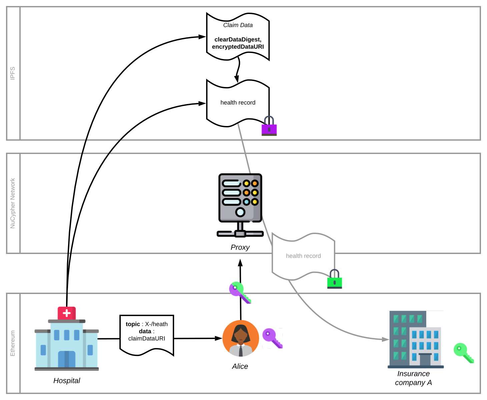

# Privacy layer on DIDs with Proxy Re-Encryption [Proof of Concept]

This proof of concept aims to highlight the suitability of proxy re-encryption frameworks like [NuCypher](https://www.nucypher.com/) to new decentralized identity schemes.

It is extensively documented in a [a Medium post](https://medium.com/@teamtech/decentralized-identity-granting-privacy-with-proxy-re-encryption-e0bf68ad465c).



## Usage

The project template is kept as close as possible to [NuCypher](https://github.com/nucypher/nucypher)'s.

Once the project is cloned, you first need to initialize and update submodules.

```sh
git submodule init
git submodule update
```

Then you can run the proof of concept.

```sh
./run_did_demo_docker.sh
```

Requirements include `docker` and `docker-compose`.